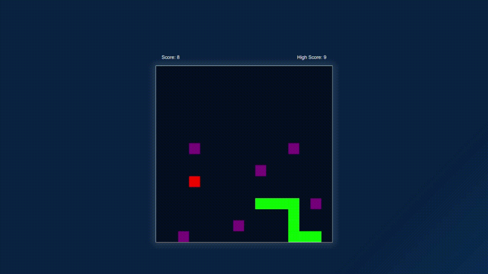

# Snake Game Variations

[NotSnake](https://cr-daniel.github.io/not-snake/) features a variety of snake game versions that can be played in the browser.

## Features

- 10 unique game versions.
- High score tracking for each game version.
- A variety of game mechanics including bound, toxic apples, invisible tail, and speed variations.

## Game Versions

Here is the list of game versions along with their distinctive features:

1. "Just the usual." - The classic snake game. No bounds and no toxic apples.
2. "Now with bounds." - The classic game but with boundaries.
3. "What if there are 3 toxic apples every time?" - Game with boundaries and three toxic apples.
4. "What about 6?" - Game with boundaries and six toxic apples.
5. "Maybe 12?" - Game with boundaries and twelve toxic apples.
6. "Too much? What about just having a long tail forever?" - Game with a long fixed tail.
7. "What about having the tail decrease when you eat the apple?" - Game with a decreasing tail length on eating an apple.
8. "What if the tail is invisible?" - Game with an invisible snake tail.
9. "Do you like speed?" - Speed variation of the classic game.
10. "Remember toxic apples?" - Speed variation of the game with six toxic apples.
